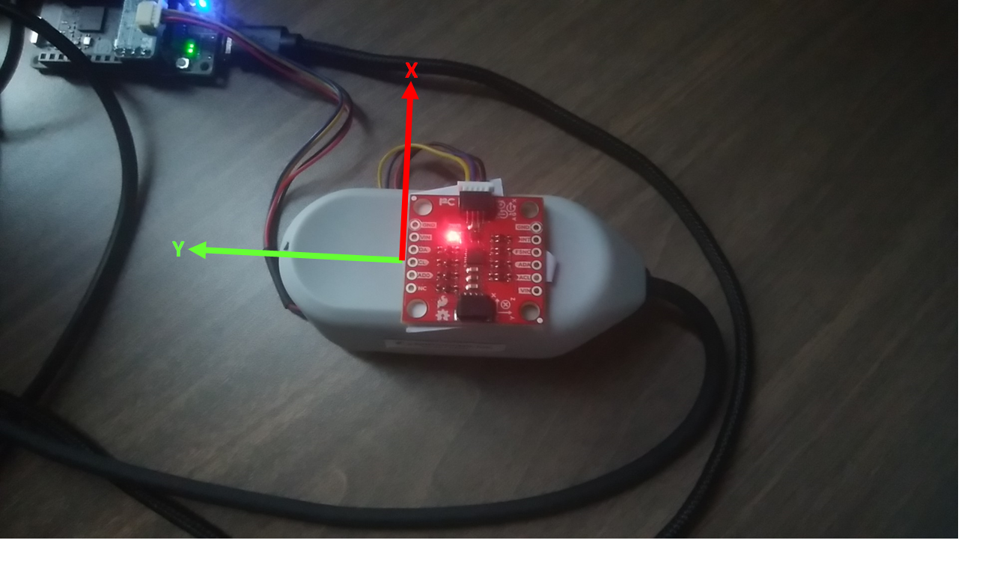
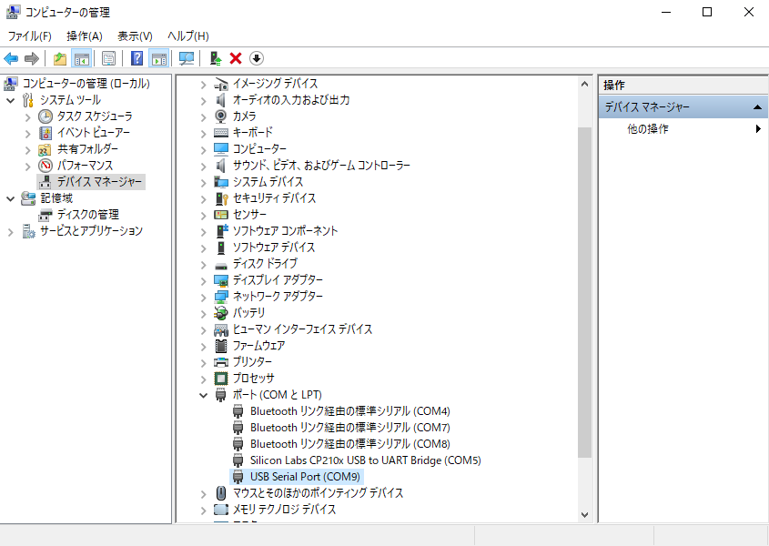
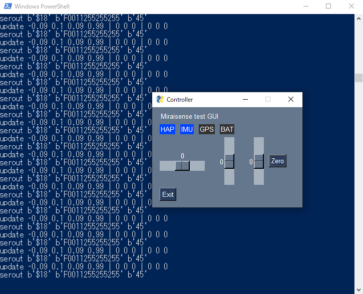

# TestTools
## 環境
- 対応OS Win10 Linux
- Pythonバージョン 3.8

## 追加パッケージ
### PySimpleGUI  
新しいPythonのGUIフレームワーク
~~~
pip install pysinplegui
~~~
マルチバージョン環境(3.5と3.8が同居)ではインストールに注意ください
~~~
py -3.8 -m pip install pysimplegui
~~~

### PySerial  
シリアルポートドライバーパッケージ
~~~
pip install pyserial
~~~

### Bleak
BLEライブラリ
注意！Pythonは3.8以降でないとエラーとなります。
インストール
~~~
pip install bleak
~~~
テストプログラムはbl.pyです。アドバタイズビーコンのDiscoveryを行います。
~~~
python bl.py
~~~
マルチバージョン環境で強制で3.8で起動する
~~~
py -3.8 bl.py
~~~

## 準備
- デバイスの座標系  
デバイスの座標系は下図のようになっています。この向きに一致したジャイロの配置は下図のようになります。

- SPRESENSEドライバー  
以下のURLの*USBドライバーのインストール*を参考にドライバーをインストください。  
https://developer.sony.com/develop/spresense/docs/arduino_set_up_ja.html

- COMポート番号  
デバイスおよびSPRESENSEは**COMポート**として認識されます。
  
Silicon Lab...がSPRESENSE、USBシリアルポートがHapticsデバイスです。  
それぞれのポート名に合わせて、hapt_xyz.pyの9,14行目を修正します(下記参照)。

~~~
##########################################
#Hap device driver
import hdvr_ser as hdvr
hdvr.PORT='COM9'

##########################################
#Spresense serial driver
import sdvr_ser as sdvr
sdvr.PORT='COM5'

##########################################
~~~

## 実行
- シェルを開く
hapt_xyz.pyを展開したディレクトリにてシェルを開きます(Shift+右クリックで*Power shell*を開く)。

- 起動  
シェルから以下を打ち込んで起動する
~~~
python hapt_xyz.py
~~~
起動すると以下の表示となります。さらに数秒するとPower shellにデバッグログの繰り返し表示が始まります。この状態が起動完了です。

- 操作  
GUIのパネルにて操作します。画面ウィジェットは以下の仕様です。
<table border>
<tr><th rowspan="2">1段目<td>HAPラベル<td>IMUラベル<td>GPSラベル<td>BATラベル
<tr><td>Hapticalデバイスと接続で点灯<td>Spresense(ジャイロ)と接続で点灯
<tr><th rowspan="2">2段目<td>スライダ(横)<td>スライダ(縦)<td>スライダ(縦)<td>Zeroボタン
<tr><td>X方向力覚指令<td>Y方向力覚指令<td>Z方向力覚指令<td>全方向の指令を０にする
<tr><th rowspan="2">3段目<td>Exitボタン
<tr><td>プログラムを終了する
</table>

- ログ  
Power shellにはデバッグログを繰り返し表示します。ログ表示内容は以下の2種類です。
~~~
update -0.08 0.1 0.1 0.99 | 0 0 0 | 0 0 0
serout b'$18' b'F0011255255255' b'45'
~~~
  1. update  
updateに続く10個の数字の意味は
  - 左から4個がジャイロ(Quaternion)
  - 次の3個が方向指令(XYZ)
  - 最後の3個が姿勢補正後のデバイスへの指令(XYZ)

  2. serout  
seroutに続くコードは、デバイスへ送信しているコマンドを示します。